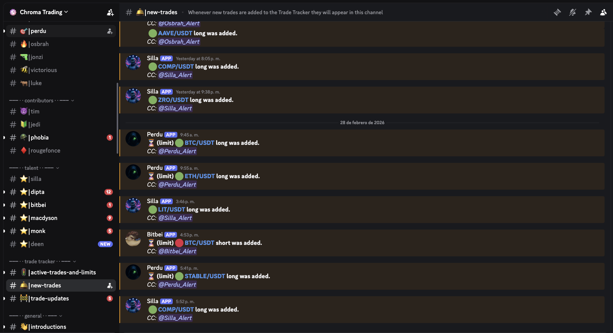
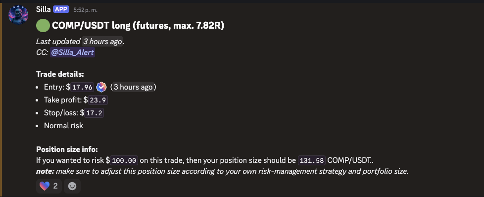

Por otro lado te quiero dejar el backlog del producto cosa que me ayudes a construirlo y hagamos en conjunto un backlog. Mandame una propuesta y lo vamos iterando:

1) Conectar con el grupo de trading de Chroma, que esta en discord, y ser capaz de agregar/cerrar posiciones a través de telegram. Ya me llegan notificaciones push cuando abrimos/SL o TP en telegram y sería ideal que ahora los call en Chroma me llegue un msje preguntando si quiero abrir una posición en Binance y que

#New-trades
 ---> Cada vez que agregan un nuevo trade al tracker se genera una notificación ahí la cual me llega un mensaje. Si vemos el interior del ultimo mensaje que es un LONG del par COMPUSDT del trade "Silla" vemos lo siguiente:

 --> Tenemos todo lo necesario para crear una orden limite ya que esta el entry price, SL y TP. (Ojo que el mensaje se puede ir actualizando) ya que a veces crean posiciones market y después agregan el SL y TP.

Por ende cada vez que se haga un trade de ciertos analistas, tener un workflow que automaticamente me agregue el trade por 1R (definido en maintainers) o bien para otros traders que sea por 0.5 R, basicamente poder configurar eso a través de maintainers. Del listado completo yo elegeir con quien entren posiciones si o si, me consulte y cuantas unidades de riesgo anotar

2) Analisis/Proyección de gastos y deudas vs ingresos. Hoy en día no tengo control de mis gastos y mi sueldo se me esta haciendo poco dado los gastos que tengo y porque no llevo control. seria ideal que yo pueda ingresar mis gastos del día con una estructura como la que tenia en su momento con Fintonic (cerro en chile), pero tengo varios analisis mensuales en donde veia mis gastos:
https://docs.google.com/spreadsheets/d/13gp6Uk1vY3ApGzLoj_IQj1i7X7itmnSjmnxiEwQtZ6k/edit?usp=sharing 

Aquí podemos ver que en la hoja "Movimiento full" esta toda la data que cargaba en la aplicación  en donde estan los siguientes campos clave:

Fecha: Fecha en que ocurrió el gasto
Importe: Valor en la moneda específicada. 99% será en CLP
Moneda: Moneda del movimiento, por defecto siempre debe ser CLP
Concepto: Dado que los movimientos se generaban automaticamente en la app, era la descripción que tenian del banco. Se podria borrar u omitir ya que lo que mas me importa es la categoría + nota
Entidad: Entidad en donde se realizo el gasto, aquí por ejemplo sería definir si lo hice en TENPO, Scotiabank o Itau que son los bancos que utilizo
Nombre de producto: Que tarjeta se utilizo
Tipo de producto: Donde se realizo el movimiento si en la cuenta corriente o en una tarjeta
Tipo de movimiento: Ocupaba este tipo de movimiento para ver si se deberia contabilizar el gasto o no, ya que por ejemplo a principio de mes pagaba la tarjeta pero no queria que fuera un 2ble gasto en el mes ya que era el pago de la tarjeta y los movimientos del mes anterior. 
Categoría: CLAVE. 
Nota: Comentarios sobre el gasto. un varchar de 255 max
USD: Valor en USD, monto referencial que se debe poder editar. Sacar con el valor del dolar del día o bien lo que hacia cuando me bajaba todos los movimientos era uqe definia 1 valor para USD y de ahí realizaba la conversión

Ideal que esto lo pueda hacer por la UI del proyecto en localhost o bien poder tambien ingresar gastos a través de telegram. Versión futura seria poder obtener todo automaticamente con un CRON cada 1 hora y que vea mis movimientos en mis respectivos bancos.

3) Dado que voy a comprar una cuenta de breakout seria tambien ideal poder manejar los trades desde el dashboard, por ende ver si nos podemos conectar via API y considerar que hace poco fue adquirido por Kraken

4) Mejorar las funcionalidades con TG: Dado que no puedo estar con mi PC todo el día seria ideal poder manejar mas cosas en TG. Hoy en dia es meramente informativo para las posiciones en Binance (y no sé si funciona en caso que apague el proxy) pero la idea en el futuro es:

* Abrir/cerrar/gestionar posiciones vivas en cualquier fuente (Binance, breakout, etc..) en la cual tenga una API-key con edición de los movimientos. No aplica para quantfury x ejemplo ya que no tenemos API
* Ingresar/editar/pedir resumen del módulo de control de gastos, el cual te describi en el punto 2
* Agregar alertas de precio o bien si se cumplen ciertos indicadores específicos (RSI en el futuro y otros que determinemos)

Dado que para lo anterior significa bastante trabajo me interesa que en conjunto planifiquemos un backlog por etapas y vayamos desarrollando de manera incremental. tambien importante si necesitamos una VM en algun lado me avises y evaluemos el costo de tenerla corriendo constantemente y evaluamos. Basicamente la pregunta es si ya es momento de hacer un upgrade a nuestra infra dada la solicitud que te comento. Importante que evaluemos bien los costos ya que mi flujo de caja es MUY limitado.

